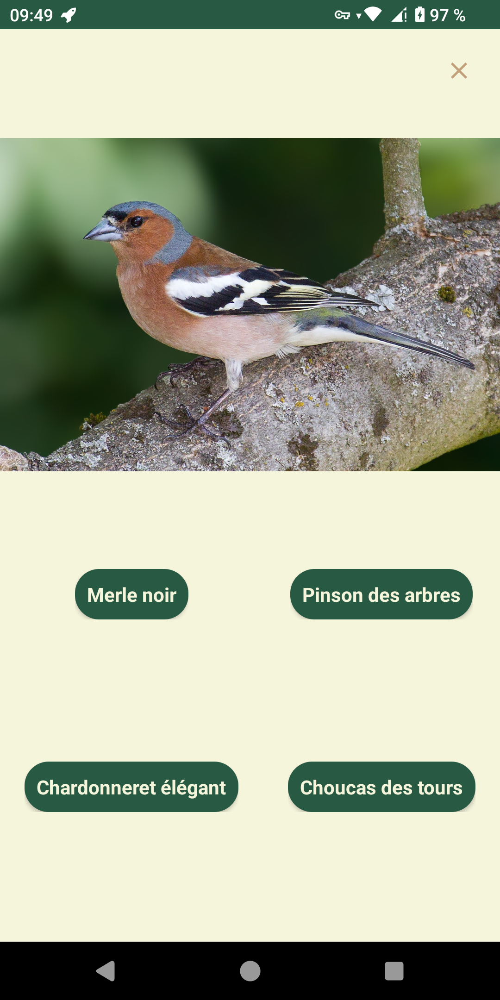
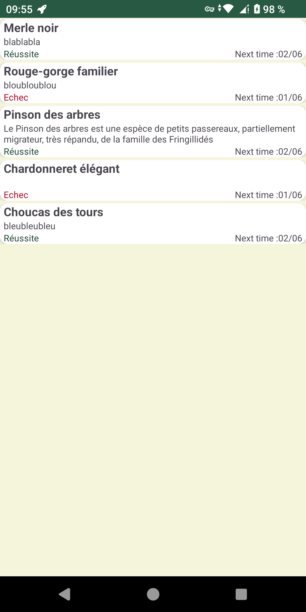
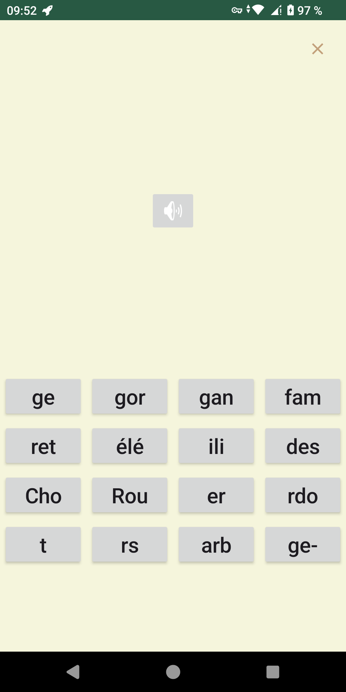
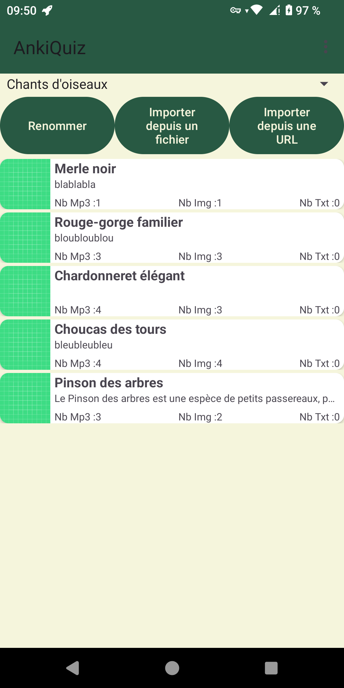

# AnkiQuiz

 
###  A simple learning app using spaced repetition

- Import and edit your own set of cards.
- Multiple images/sounds/texts for one answer, so you can't memorise THIS media but must learn variants.
- Multiple set of cards, and you can choose witch one you whant to learn.
- Lightweight app with no ad, no internet access or witch will not ask for any permission.

###  Get it now!

### Features

- Import/Export cards as zip file.
- Edit your cards directly in the app.
- Multiple media possible (sound, image and text).
- Simple as hell and will stay this way.

### Screens

